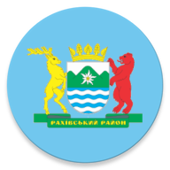
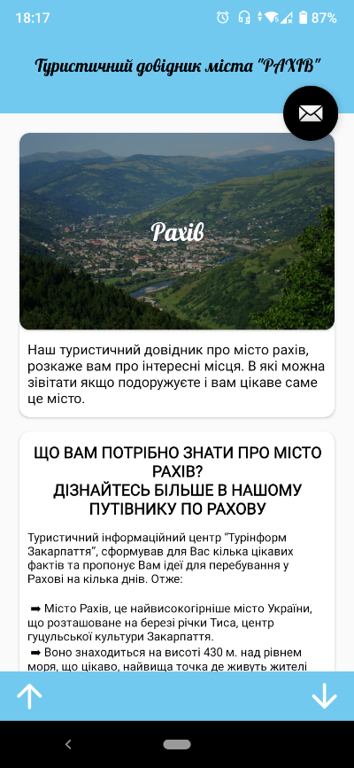
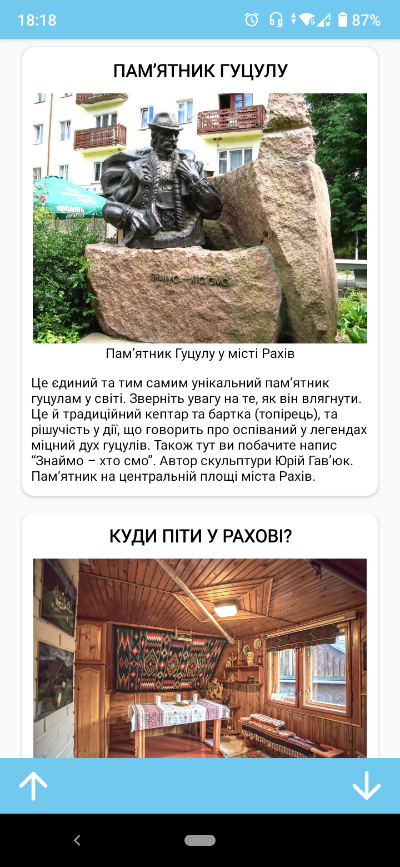
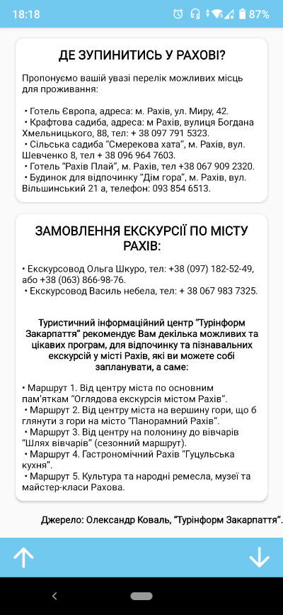
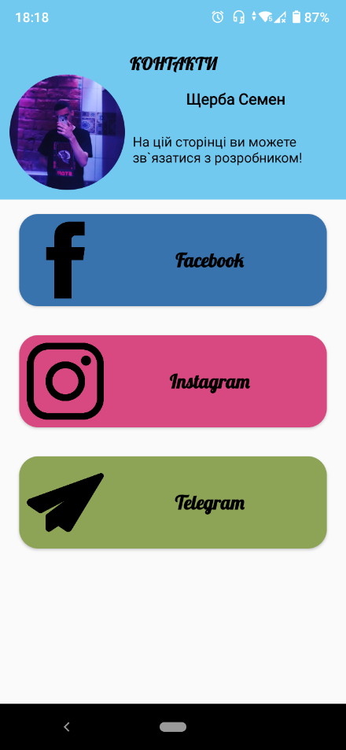

<p align="center"></p>
<h1 align="center">TouristguideofthecityRAKHIV</h1>

## Description
<b>EN:</b>

Ordered course work on the topic "Design and development of the software product «Tourist guide of the city "**Rakhiv**"»".

This is a mobile travel guide application that is a continuation of the previous course work ([city-of-rakhiv.com](https://github.com/CoolOtaku/city-of-rakhiv.com)).

<b>UA:</b>

Замовлена курсова робота на тему "Проектування та розробка програмного продукту «Туристичний довідник міста "**Рахів**"»".

Це мобільний додаток туристичний довідник, який є продовженням попередньої курсової роботи ([city-of-rakhiv.com](https://github.com/CoolOtaku/city-of-rakhiv.com)).

#
## Screenshots
<p>
  
  
  
  
</p>

#
## Technologies used
<b>EN:</b>
- Convenient navigation through the application

<b>UA:</b>
- Зручна навігація через додаток

#
## License
```
© 2022, CoolOtaku (ericspz531@gmail.com)
```
